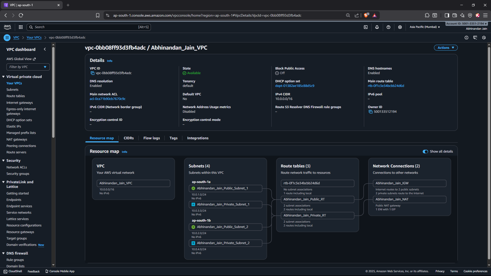
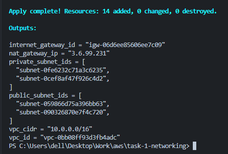

# Task 1: AWS VPC Networking & Subnetting

## 📋 Project Overview

This project demonstrates the design and implementation of a production-ready AWS Virtual Private Cloud (VPC) with multi-tier networking architecture. The infrastructure includes public and private subnets across multiple availability zones, internet connectivity via Internet Gateway, and secure outbound access through NAT Gateway.

---

## 🎯 Objectives

1. Design a scalable VPC network architecture
2. Implement public and private subnet segregation
3. Configure internet connectivity for public resources
4. Enable secure outbound internet access for private resources
5. Deploy infrastructure across multiple availability zones for high availability

---

## 🏗️ Architecture

### IP Address Allocation

| Resource | CIDR Block | Available IPs | Purpose |
|----------|------------|---------------|---------|
| VPC | 10.0.0.0/16 | 65,536 | Entire network |
| Public Subnet 1 | 10.0.1.0/24 | 251 | Internet-facing resources (AZ-1a) |
| Public Subnet 2 | 10.0.2.0/24 | 251 | Internet-facing resources (AZ-1b) |
| Private Subnet 1 | 10.0.3.0/24 | 251 | Backend services (AZ-1a) |
| Private Subnet 2 | 10.0.4.0/24 | 251 | Backend services (AZ-1b) |

---

## 📐 Design Decisions

### 1. **VPC CIDR: 10.0.0.0/16**

**Reasoning:**
- Provides 65,536 IP addresses for growth
- /16 netmask allows creation of 256 /24 subnets
- Uses RFC 1918 private address space (standard practice)
- Large enough for enterprise workloads, small enough to avoid waste

### 2. **Subnet CIDR: /24 Blocks**

**Reasoning:**
- Each /24 provides 251 usable IP addresses (256 - 5 AWS reserved)
- Sufficient for most small-to-medium deployments
- Easy to remember and calculate (256 addresses per subnet)
- Allows for future subnet growth without complex calculations

**AWS Reserved IPs per Subnet:**
- `.0` - Network address
- `.1` - VPC router
- `.2` - DNS server
- `.3` - Future use
- `.255` - Broadcast address

### 3. **Multi-AZ Deployment**

**Reasoning:**
- **High Availability**: If us-east-1a fails, us-east-1b continues operating
- **Fault Tolerance**: Reduces single point of failure
- **Best Practice**: AWS recommends multi-AZ for production workloads
- **Load Distribution**: Can distribute workloads across zones

### 4. **Public/Private Subnet Segregation**

**Reasoning:**
- **Security**: Backend services isolated from direct internet exposure
- **Defense in Depth**: Multiple security layers
- **Compliance**: Many frameworks require network segmentation
- **Flexibility**: Can apply different security policies per tier

### 5. **NAT Gateway in Public Subnet**

**Reasoning:**
- Private instances need outbound internet for updates/patches
- NAT Gateway requires public IP (Elastic IP)
- Provides secure, one-way internet access for private subnets
- Managed service - no maintenance required

---

## 📊 Resources Created

| Resource Type | Count | Purpose |
|---------------|-------|---------|
| VPC | 1 | Network container |
| Subnets | 4 | Network segmentation |
| Internet Gateway | 1 | Public internet access |
| NAT Gateway | 1 | Private outbound internet |
| Elastic IP | 1 | Static IP for NAT |
| Route Tables | 2 | Traffic routing |
| Route Table Associations | 4 | Subnet-route table links |

## 📸 Screenshots

### Required Screenshots Included

1. **VPC Details** (`screenshots/vpc-resources.png`)
   - Shows VPC ID, CIDR block, and DNS settings
   

2. **VPC Creation in Terminal** (`screenshots/terminal-vpc-creation.png`)
   - Shows VPC Creation in terminal
    
