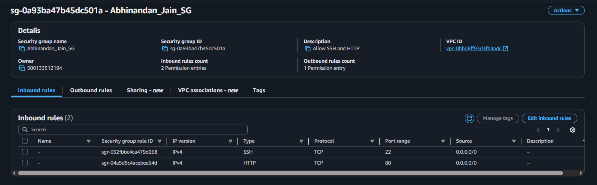
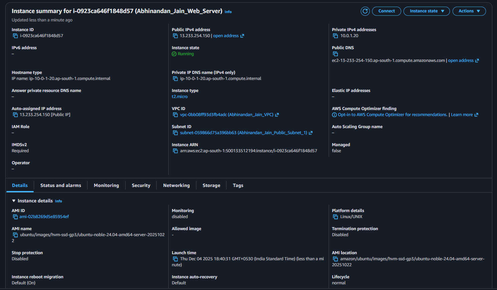
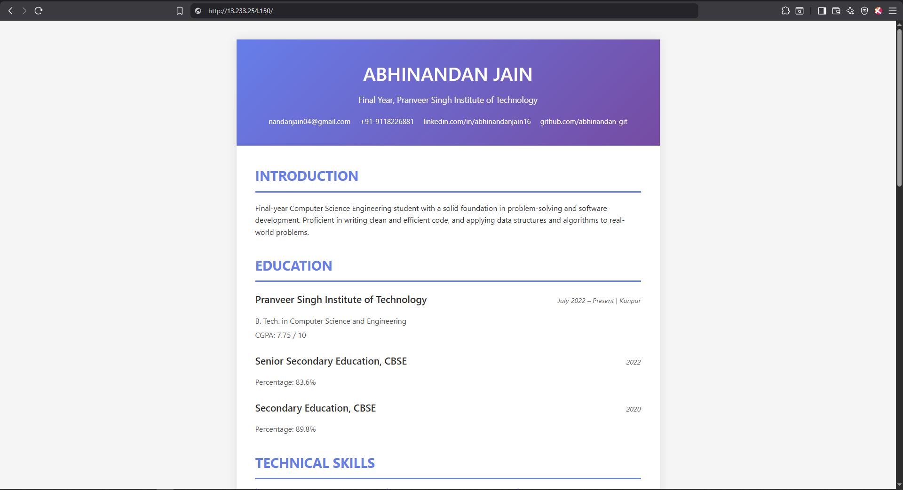

# Task 2: EC2 Static Website Hosting with Nginx

## 📋 Project Overview

This project demonstrates deploying a static resume website on Amazon EC2 using Nginx web server, with implementation of AWS security best practices and infrastructure hardening. The deployment showcases fundamental cloud engineering skills including Linux server administration, web server configuration, and security hardening.

---

## 🎯 Objectives

1. Launch and configure an Amazon EC2 instance
2. Install and configure Nginx web server
3. Deploy a custom static HTML resume website
4. Implement infrastructure security hardening
5. Apply AWS best practices for basic web hosting
6. Document the deployment process
### Components

| Component | Details | Purpose |
|-----------|---------|---------|
| **EC2 Instance** | t2.micro, Amazon Linux 2023 | Web server hosting |
| **Nginx** | Latest stable version | HTTP server & reverse proxy |
| **Security Group** | SSH (22), HTTP (80) | Network firewall |
| **Elastic IP** | Optional | Static public IP address |
| **EBS Volume** | 8 GB gp3 | Root volume storage |

---

## 🚀 Deployment Steps

### Prerequisites

- AWS Account with Free Tier
- Completed Task 1 (VPC setup)
- SSH client installed
- Basic HTML/CSS knowledge
- Text editor (VS Code, Sublime, etc.)

### Step 1: Launch EC2 Instance

**Via AWS Console:**

1. Navigate to **EC2 Dashboard**
2. Click **Launch Instance**
3. Configure as follows:

```yaml
Name: YourName_WebServer
AMI: Amazon Linux 2023 AMI (64-bit x86)
Instance Type: t2.micro (Free Tier)
Key Pair: YourName_KeyPair (create new, download .pem file)

Network Settings:
  VPC: YourName_VPC (from Task 1)
  Subnet: Public Subnet 1 (10.0.1.0/24)
  Auto-assign Public IP: Enable

Security Group: YourName_Web_SG
  - SSH (22): My IP only
  - HTTP (80): 0.0.0.0/0 (Anywhere)

Storage: 8 GB gp3 (default)
```

4. **Launch** instance
5. Save the Public IPv4 address

### Step 2: Connect to Instance

**For Mac/Linux:**
```bash
# Set correct permissions for key file
chmod 400 YourName_KeyPair.pem

# Connect via SSH
ssh -i "YourName_KeyPair.pem" ec2-user@<your-public-ip>

# Example:
ssh -i "YourName_KeyPair.pem" ec2-user@54.123.45.67
```

**For Windows (PowerShell):**
```powershell
# Using OpenSSH (Windows 10+)
ssh -i "YourName_KeyPair.pem" ec2-user@<your-public-ip>
```

**For Windows (PuTTY):**
1. Convert .pem to .ppk using PuTTYgen
2. Open PuTTY
3. Host: `ec2-user@<your-public-ip>`
4. Connection → SSH → Auth → Browse for .ppk file
5. Click **Open**

### Step 3: Install Nginx

```bash
# Update all system packages
sudo yum update -y

# Install Nginx
sudo yum install nginx -y

# Start Nginx service
sudo systemctl start nginx

# Enable Nginx to start on boot
sudo systemctl enable nginx

# Check status
sudo systemctl status nginx
```

**Verify Installation:**
- Open browser: `http://<your-public-ip>`
- You should see the default Nginx welcome page

### Step 4: Deploy Resume Website

```bash
# Navigate to web root
cd /usr/share/nginx/html

# Backup default page
sudo mv index.html index.html.backup

# Create new index.html
sudo nano index.html
```

Paste the HTML content (see `website/index.html` in this repository), then:

```bash
# Save: Ctrl+X, Y, Enter

# Set proper permissions
sudo chmod 644 /usr/share/nginx/html/index.html
sudo chown nginx:nginx /usr/share/nginx/html/index.html

# Restart Nginx
sudo systemctl restart nginx
```

**Verify Deployment:**
- Refresh browser: `http://<your-public-ip>`
- You should see your custom resume website

---

## 🔒 Security Hardening

### 1. Update System & Enable Auto-Updates

```bash
# Install automatic security updates
sudo yum install yum-cron -y

# Configure yum-cron for security updates
sudo nano /etc/yum/yum-cron.conf
```

Change these lines:
```ini
update_cmd = security
apply_updates = yes
```

```bash
# Enable and start service
sudo systemctl enable yum-cron
sudo systemctl start yum-cron
```

### 2. Configure Firewall (firewalld)

```bash
# Start firewalld
sudo systemctl start firewalld
sudo systemctl enable firewalld

# Allow HTTP and SSH
sudo firewall-cmd --permanent --add-service=http
sudo firewall-cmd --permanent --add-service=ssh

# Remove unnecessary services
sudo firewall-cmd --permanent --remove-service=dhcpv6-client

# Apply changes
sudo firewall-cmd --reload

# Verify configuration
sudo firewall-cmd --list-all
```

Expected output:
```
public (active)
  target: default
  services: http ssh
  ports: 
  protocols: 
```

### 3. Harden SSH Configuration

```bash
# Edit SSH config
sudo nano /etc/ssh/sshd_config
```

Update these settings:
```bash
# Disable root login
PermitRootLogin no

# Disable password authentication (key-only)
PasswordAuthentication no

# Enable public key authentication
PubkeyAuthentication yes

# Limit authentication attempts
MaxAuthTries 3

# Set idle timeout
ClientAliveInterval 300
ClientAliveCountMax 2

# Allow specific user only (optional)
AllowUsers ec2-user
```

```bash
# Restart SSH service
sudo systemctl restart sshd
```

⚠️ **Warning:** Test SSH connection in a new terminal before closing current session!

### 4. Secure Nginx Configuration

```bash
# Edit Nginx config
sudo nano /etc/nginx/nginx.conf
```

Add security headers inside `http` block:
```nginx
http {
    # Hide Nginx version
    server_tokens off;
    
    # Security headers
    add_header X-Frame-Options "SAMEORIGIN" always;
    add_header X-Content-Type-Options "nosniff" always;
    add_header X-XSS-Protection "1; mode=block" always;
    add_header Referrer-Policy "strict-origin-when-cross-origin" always;
    
    # Existing configuration...
}
```

```bash
# Test configuration
sudo nginx -t

# Reload Nginx
sudo systemctl reload nginx
```

### 5. Install Fail2Ban (Optional but Recommended)

```bash
# Install EPEL repository
sudo yum install epel-release -y

# Install Fail2Ban
sudo yum install fail2ban -y

# Copy default config
sudo cp /etc/fail2ban/jail.conf /etc/fail2ban/jail.local

# Edit config
sudo nano /etc/fail2ban/jail.local
```

Configure SSH jail:
```ini
[sshd]
enabled = true
port = ssh
logpath = /var/log/secure
maxretry = 3
bantime = 3600
findtime = 600
```

```bash
# Start Fail2Ban
sudo systemctl start fail2ban
sudo systemctl enable fail2ban

# Check status
sudo fail2ban-client status sshd
```

### 6. Security Group Configuration

**Current Rules:**

**Inbound:**
| Type | Protocol | Port | Source | Purpose |
|------|----------|------|--------|---------|
| SSH | TCP | 22 | Your IP | Remote management |
| HTTP | TCP | 80 | 0.0.0.0/0 | Web traffic |

**Outbound:**
| Type | Protocol | Port | Destination | Purpose |
|------|----------|------|-------------|---------|
| All | All | All | 0.0.0.0/0 | Updates & patches |

⚠️ **Security Note:** SSH is restricted to your IP only. Update if your IP changes.

---

## 📊 Monitoring & Maintenance

### Check Nginx Status
```bash
sudo systemctl status nginx
```

### View Nginx Logs
```bash
# Access logs
sudo tail -f /var/log/nginx/access.log

# Error logs
sudo tail -f /var/log/nginx/error.log
```

### Monitor System Resources
```bash
# CPU and memory usage
top

# Disk usage
df -h

# Check open ports
sudo ss -tuln
```

### Update Website Content
```bash
# Edit index.html
sudo nano /usr/share/nginx/html/index.html

# Restart Nginx
sudo systemctl restart nginx
```

---

## 🧪 Testing & Verification

### 1. Test Website Accessibility
```bash
# From local machine
curl http://<your-public-ip>

# Should return HTML content
```

### 2. Test Security Headers
```bash
curl -I http://<your-public-ip>
```

Expected headers:
```
HTTP/1.1 200 OK
Server: nginx
X-Frame-Options: SAMEORIGIN
X-Content-Type-Options: nosniff
X-XSS-Protection: 1; mode=block
```

### 3. Test SSH Security
```bash
# Try root login (should fail)
ssh root@<your-public-ip>
# Permission denied

# Try with wrong key (should fail after 3 attempts)
```

### 4. Test Firewall
```bash
# On EC2 instance
sudo firewall-cmd --list-all

# Test from outside
nmap <your-public-ip>
# Should only show ports 22 and 80
```

---

## 📸 Screenshots

### Required Screenshots Included

1. Security Groups Creation (`screenshots/security-group.png`)


2. EC2 Creation (`screenshots/ec2-instance.png`)


3. Live website (`screenshots/website-live.png`)


## 🔄 Deployment Explanation

### Brief Technical Summary

"I deployed a static resume website on an Amazon EC2 t2.micro instance running Ubuntu in a public subnet for direct internet access. Nginx was selected as the web server due to its lightweight footprint, excellent performance for static content, and ease of configuration. The instance is secured through a carefully configured Security Group that allows only SSH access from my IP address and HTTP traffic from anywhere. 

I implemented comprehensive infrastructure hardening measures including firewalld configuration to limit exposed ports, SSH hardening with root login disabled and key-only authentication enforced, automated security updates via yum-cron for continuous patching, and Nginx security headers (X-Frame-Options, X-Content-Type-Options, X-XSS-Protection) to prevent common web attacks like clickjacking and XSS. 

Additionally, Fail2Ban was installed to provide automated intrusion prevention by temporarily blocking IP addresses after failed authentication attempts. The website is publicly accessible via the EC2 instance's public IP address on standard HTTP port 80, demonstrating a secure, production-ready web hosting setup following AWS and industry best practices."
