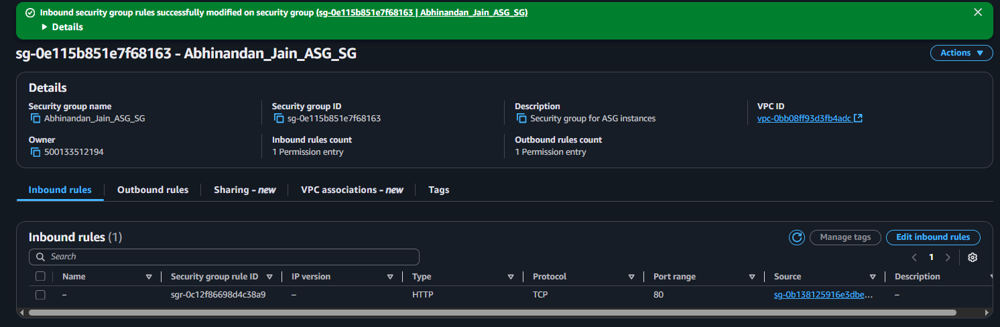
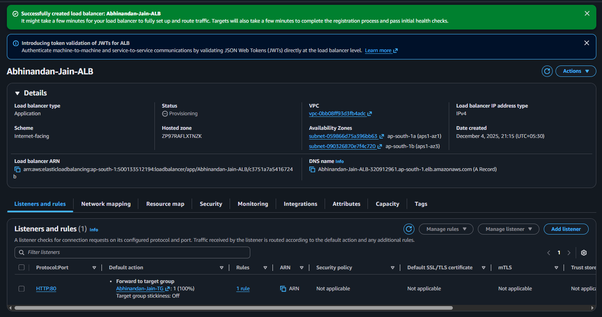
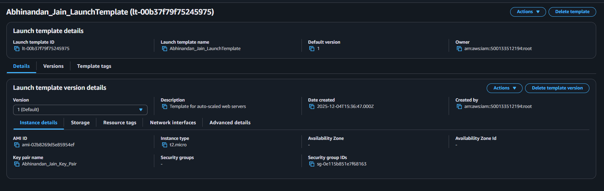
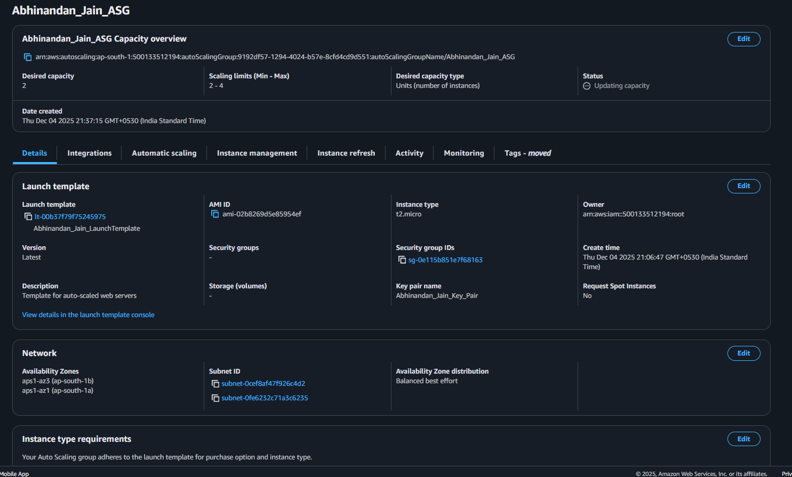
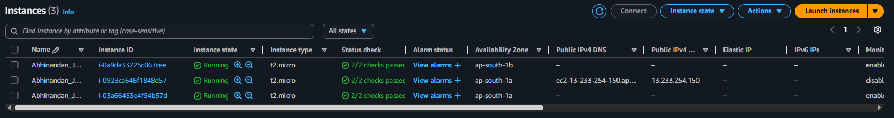

# Task 3: High Availability & Auto Scaling Architecture

## 📋 Project Overview

This project demonstrates the transformation of a single-server architecture into a highly available, auto-scaling infrastructure capable of handling variable traffic loads. The implementation uses Application Load Balancer (ALB) for traffic distribution, Auto Scaling Groups (ASG) for dynamic capacity management, and multi-availability zone deployment for fault tolerance.

---

## 🎯 Objectives

1. Deploy Application Load Balancer for traffic distribution
2. Create Launch Template for consistent instance configuration
3. Implement Auto Scaling Group with dynamic scaling policies
4. Move EC2 instances to private subnets for enhanced security
5. Achieve high availability through multi-AZ deployment
6. Configure automated health checks and instance replacement
7. Implement proper traffic routing architecture

---

## 📸 Screenshots

### Required Screenshots Included

1. ALB configuration


2. ALB Health


3. Target Group


4. Auto Scaling Group


5. EC2 instances launched via ASG


---

## 🏗️ Architecture

### Component Details

| Component | Specification | Purpose |
|-----------|---------------|---------|
| **Application Load Balancer** | Internet-facing, Multi-AZ | Distribute incoming HTTP traffic |
| **Target Group** | HTTP:80, Health checks every 30s | Group and monitor backend instances |
| **Auto Scaling Group** | Min: 2, Desired: 2, Max: 4 | Dynamic capacity management |
| **Launch Template** | Amazon Linux 2023, t2.micro | Instance configuration blueprint |
| **Private Subnets** | 10.0.3.0/24, 10.0.4.0/24 | Isolated backend network |
| **Security Groups** | ALB-SG, Instance-SG | Network access control |
| **Scaling Policy** | Target Tracking, CPU 50% | Automated scaling decisions |

---

## 🚀 Deployment Steps

### Prerequisites

- ✅ Completed Task 1 (VPC with public/private subnets)
- ✅ Completed Task 2 (Basic EC2 understanding)
- AWS Console access
- Understanding of load balancing concepts

### Step 1: Create Security Groups

#### 1.1 ALB Security Group

```bash
Name: YourName_ALB_SG
Description: Allow HTTP traffic to Application Load Balancer
VPC: YourName_VPC

Inbound Rules:
- Type: HTTP
- Port: 80
- Source: 0.0.0.0/0 (Anywhere IPv4)
- Description: Allow web traffic from internet

Outbound Rules:
- Type: All Traffic
- Destination: 0.0.0.0/0
```

#### 1.2 Instance Security Group

```bash
Name: YourName_ASG_SG
Description: Allow traffic from ALB to instances
VPC: YourName_VPC

Inbound Rules:
- Type: HTTP
- Port: 80
- Source: YourName_ALB_SG (Security Group ID)
- Description: Allow traffic from ALB only

Outbound Rules:
- Type: All Traffic
- Destination: 0.0.0.0/0
- Description: Allow outbound for updates
```

**Security Architecture:**
- ✅ ALB accepts traffic from internet
- ✅ Instances accept traffic only from ALB
- ✅ Defense in depth approach
- ✅ No direct instance internet exposure

### Step 2: Create Launch Template

```bash
Navigate to: EC2 → Launch Templates → Create Launch Template

Name: YourName_LaunchTemplate
Description: Template for auto-scaled web servers

Template Settings:
├── Application and OS Images
│   └── AMI: Amazon Linux 2023 AMI
├── Instance Type: t2.micro
├── Key Pair: YourName_KeyPair
├── Network Settings
│   ├── Don't include in launch template
│   └── (ASG will handle network configuration)
├── Security Groups: YourName_ASG_SG
├── Storage: 8 GB gp3
└── Advanced Details
    ├── IAM Instance Profile: None
    ├── Detailed CloudWatch Monitoring: Enable
    └── User Data: [See user-data.sh below]
```

**User Data Script** (`scripts/user-data.sh`):

```bash
#!/bin/bash
# This script runs at instance launch

# Update system
yum update -y

# Install Nginx
yum install nginx -y

# Get instance metadata
INSTANCE_ID=$(ec2-metadata --instance-id | cut -d " " -f 2)
AVAILABILITY_ZONE=$(ec2-metadata --availability-zone | cut -d " " -f 2)
PRIVATE_IP=$(ec2-metadata --local-ipv4 | cut -d " " -f 2)

# Create dynamic homepage
cat > /usr/share/nginx/html/index.html << EOF
<!DOCTYPE html>
<html lang="en">
<head>
    <meta charset="UTF-8">
    <meta name="viewport" content="width=device-width, initial-scale=1.0">
    <title>High Availability Demo</title>
    <style>
        body {
            font-family: 'Segoe UI', sans-serif;
            background: linear-gradient(135deg, #667eea 0%, #764ba2 100%);
            display: flex;
            justify-content: center;
            align-items: center;
            min-height: 100vh;
            margin: 0;
        }
        .container {
            background: white;
            padding: 40px;
            border-radius: 10px;
            box-shadow: 0 20px 60px rgba(0,0,0,0.3);
            text-align: center;
            max-width: 600px;
        }
        h1 { color: #667eea; margin-bottom: 30px; }
        .info-grid {
            display: grid;
            gap: 15px;
            margin: 20px 0;
            text-align: left;
        }
        .info-item {
            background: #f8f9ff;
            padding: 15px;
            border-radius: 5px;
            border-left: 4px solid #667eea;
        }
        .label { font-weight: bold; color: #764ba2; }
        .success { color: #28a745; font-size: 1.2em; margin: 20px 0; }
        .footer { margin-top: 30px; color: #666; font-size: 0.9em; }
    </style>
</head>
<body>
    <div class="container">
        <h1>🚀 High Availability Web Server</h1>
        <p class="success">✓ Successfully Load Balanced!</p>
        
        <div class="info-grid">
            <div class="info-item">
                <span class="label">Instance ID:</span> ${INSTANCE_ID}
            </div>
            <div class="info-item">
                <span class="label">Availability Zone:</span> ${AVAILABILITY_ZONE}
            </div>
            <div class="info-item">
                <span class="label">Private IP:</span> ${PRIVATE_IP}
            </div>
            <div class="info-item">
                <span class="label">Server:</span> Nginx on Amazon Linux 2023
            </div>
        </div>
        
        <div class="footer">
            <p><strong>Architecture:</strong> Auto Scaling Group behind Application Load Balancer</p>
            <p><strong>Tip:</strong> Refresh this page multiple times to see different instances!</p>
        </div>
    </div>
</body>
</html>
EOF

# Set permissions
chmod 644 /usr/share/nginx/html/index.html
chown nginx:nginx /usr/share/nginx/html/index.html

# Start and enable Nginx
systemctl start nginx
systemctl enable nginx

# Configure firewall
systemctl start firewalld
systemctl enable firewalld
firewall-cmd --permanent --add-service=http
firewall-cmd --reload
```

### Step 3: Create Target Group

```bash
Navigate to: EC2 → Target Groups → Create Target Group

Basic Configuration:
├── Target Type: Instances
├── Name: YourName-TG
├── Protocol: HTTP
├── Port: 80
└── VPC: YourName_VPC

Health Check Settings:
├── Protocol: HTTP
├── Path: /
├── Port: Traffic port
├── Healthy Threshold: 2 consecutive checks
├── Unhealthy Threshold: 2 consecutive checks
├── Timeout: 5 seconds
├── Interval: 30 seconds
└── Success Codes: 200

Advanced Settings:
├── Deregistration Delay: 300 seconds
└── Stickiness: Disabled (optional: enable for session persistence)

Register Targets: Skip (ASG will handle)
```

**Health Check Logic:**
- Every 30 seconds, ALB sends HTTP GET to `/`
- If returns 200 OK: Mark healthy
- 2 consecutive successes: Instance is healthy
- 2 consecutive failures: Instance is unhealthy (removed from rotation)

### Step 4: Create Application Load Balancer

```bash
Navigate to: EC2 → Load Balancers → Create Load Balancer
Select: Application Load Balancer

Basic Configuration:
├── Name: YourName-ALB
├── Scheme: Internet-facing
└── IP Address Type: IPv4

Network Mapping:
├── VPC: YourName_VPC
└── Availability Zones:
    ├── ☑ us-east-1a → Public Subnet 1 (10.0.1.0/24)
    └── ☑ us-east-1b → Public Subnet 2 (10.0.2.0/24)

Security Groups:
└── YourName_ALB_SG (remove default)

Listeners and Routing:
├── Protocol: HTTP
├── Port: 80
└── Default Action: Forward to YourName-TG

Create Load Balancer
```

**Wait for Status:** Active (~2-3 minutes)

**Copy DNS Name:** `YourName-ALB-1234567890.us-east-1.elb.amazonaws.com`

### Step 5: Create Auto Scaling Group

```bash
Navigate to: EC2 → Auto Scaling Groups → Create Auto Scaling Group

Step 1: Choose Launch Template
├── Name: YourName_ASG
├── Launch Template: YourName_LaunchTemplate
└── Version: Latest (Default)

Step 2: Choose Instance Launch Options
├── VPC: YourName_VPC
└── Subnets:
    ├── ☑ Private Subnet 1 (10.0.3.0/24) - us-east-1a
    └── ☑ Private Subnet 2 (10.0.4.0/24) - us-east-1b

Step 3: Configure Advanced Options
├── Load Balancing:
│   ├── ☑ Attach to an existing load balancer
│   └── Choose from load balancer target groups: YourName-TG
├── Health Checks:
│   ├── ☑ Turn on Elastic Load Balancing health checks
│   └── Health Check Grace Period: 300 seconds
└── Monitoring:
    └── ☑ Enable group metrics collection within CloudWatch

Step 4: Configure Group Size and Scaling
├── Group Size:
│   ├── Desired Capacity: 2
│   ├── Minimum Capacity: 2
│   └── Maximum Capacity: 4
└── Scaling Policies:
    ├── ☑ Target Tracking Scaling Policy
    ├── Policy Name: CPU-Based-Scaling
    ├── Metric Type: Average CPU Utilization
    ├── Target Value: 50%
    └── Instances Need: 300 seconds warm-up

Step 5: Add Notifications (Optional)
└── Skip

Step 6: Add Tags
├── Key: Name
├── Value: YourName_ASG_Instance
└── ☑ Tag new instances

Step 7: Review and Create
```

---

## ✅ Verification & Testing

### 1. Verify Instance Launch

```bash
Navigate to: EC2 → Instances

Expected:
- 2 instances in "Running" state
- Names: YourName_ASG_Instance
- Subnets: One in 10.0.3.0/24, one in 10.0.4.0/24
- Different availability zones
- Status checks: 2/2 passed
```

### 2. Verify Target Health

```bash
Navigate to: EC2 → Target Groups → YourName-TG → Targets Tab

Expected:
- 2 registered targets
- Health Status: healthy
- Registered via: Auto Scaling Group
```

**If unhealthy, check:**
1. Security group allows ALB → Instance traffic
2. Nginx is running on instances
3. Instance is in private subnet with NAT access
4. Health check path is correct

### 3. Test Load Balancer

```bash
# Get ALB DNS name
Navigate to: EC2 → Load Balancers → YourName-ALB
Copy: DNS name

# Test in browser
Open: http://YourName-ALB-1234567890.us-east-1.elb.amazonaws.com
```

**Expected Result:**
- Website loads successfully
- Shows instance ID and availability zone
- Refresh multiple times → See different instance IDs (load balancing)

**From Command Line:**
```bash
# Test 10 requests
for i in {1..10}; do
  curl -s http://YOUR-ALB-DNS-NAME | grep "Instance ID"
done

# Expected: See different instance IDs
```

### 4. Test Auto Scaling (Scale-Out)

**Method 1: Increase Desired Capacity**
```bash
Navigate to: EC2 → Auto Scaling Groups → YourName_ASG
Click: Edit
Change: Desired Capacity = 4
Save

Monitor:
- Activity Tab: Shows "Launching a new EC2 instance"
- Target Group: Shows 4 healthy targets (after ~3 minutes)
- Instances: Shows 4 running instances
```

**Method 2: Simulate High CPU Load**
```bash
# SSH to an instance (via bastion or Systems Manager)
sudo yum install stress -y

# Generate CPU load (4 cores at 100% for 5 minutes)
stress --cpu 4 --timeout 300

# Monitor ASG Activity Tab
# After 2-3 minutes, should see scale-out activity
```

### 5. Test Auto Scaling (Scale-In)

```bash
# Reduce desired capacity
Navigate to: EC2 → Auto Scaling Groups → YourName_ASG
Edit: Desired Capacity = 2
Save

# Monitor Activity Tab
# ASG will terminate 2 instances while maintaining AZ balance
```

### 6. Test High Availability (Failover)

```bash
# Terminate one instance manually
Navigate to: EC2 → Instances
Select: One ASG instance
Actions → Instance State → Terminate

Monitor:
1. Target Group: Shows instance unhealthy → draining
2. ALB: Stops sending traffic to unhealthy instance
3. ASG Activity: Launches replacement instance
4. Total: Maintains desired capacity of 2 instances

Result: Zero downtime - ALB routes traffic to healthy instances
```

---

## 📊 Monitoring & Metrics

### CloudWatch Metrics

**Auto Scaling Group Metrics:**
```bash
Navigate to: CloudWatch → Metrics → EC2 → By Auto Scaling Group

Key Metrics:
- GroupDesiredCapacity: Target instance count
- GroupInServiceInstances: Currently running
- GroupMinSize: Minimum instances
- GroupMaxSize: Maximum instances
```

**Target Group Metrics:**
```bash
Navigate to: CloudWatch → Metrics → ApplicationELB → TargetGroup

Key Metrics:
- HealthyHostCount: Number of healthy targets
- UnHealthyHostCount: Number of unhealthy targets
- RequestCount: Requests per second
- TargetResponseTime: Average response time
```

**ALB Metrics:**
```bash
Navigate to: CloudWatch → Metrics → ApplicationELB → LoadBalancer

Key Metrics:
- ActiveConnectionCount: Current connections
- HTTPCode_Target_2XX_Count: Successful responses
- HTTPCode_Target_5XX_Count: Server errors
- TargetConnectionErrorCount: Connection failures
```

### Create CloudWatch Alarms (Recommended)

```bash
Navigate to: CloudWatch → Alarms → Create Alarm

Alarm 1: Unhealthy Targets
- Metric: UnhealthyHostCount
- Condition: >= 1
- Action: Send SNS notification
- Name: YourName-Unhealthy-Targets

Alarm 2: High Response Time
- Metric: TargetResponseTime
- Condition: > 1 second
- Action: Send SNS notification
- Name: YourName-High-Response-Time

Alarm 3: HTTP 5XX Errors
- Metric: HTTPCode_Target_5XX_Count
- Condition: >= 10 in 5 minutes
- Action: Send SNS notification
- Name: YourName-Server-Errors
```

---

## 🎯 Architecture Explanation

### Traffic Flow & High Availability Design

"This architecture transforms a single-server deployment into a highly available, auto-scaling system by deploying instances across two availability zones behind an Application Load Balancer. The ALB resides in public subnets (10.0.1.0/24, 10.0.2.0/24) and distributes incoming HTTP traffic across EC2 instances running in private subnets (10.0.3.0/24, 10.0.4.0/24), providing security through network isolation. 

An Auto Scaling Group maintains 2-4 instances based on CPU utilization, automatically launching new instances when average CPU exceeds 50% and terminating excess instances when load decreases, ensuring optimal resource utilization while controlling costs. Each instance is health-checked every 30 seconds, with unhealthy instances automatically removed from the load balancer rotation and replaced by the ASG within minutes.

The multi-AZ deployment ensures that if one availability zone experiences an outage, the application continues operating on instances in the remaining zone with zero downtime. Security groups enforce defense-in-depth with the ALB accepting public traffic while instances accept connections only from the ALB, preventing direct internet exposure. Private instances access the internet for updates through the NAT Gateway, maintaining security while enabling necessary outbound connectivity. This architecture provides automatic fault tolerance, dynamic scalability, load distribution, and enhanced security, making it suitable for production workloads requiring high availability and variable capacity."

---
