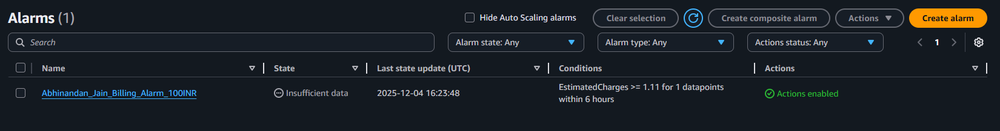
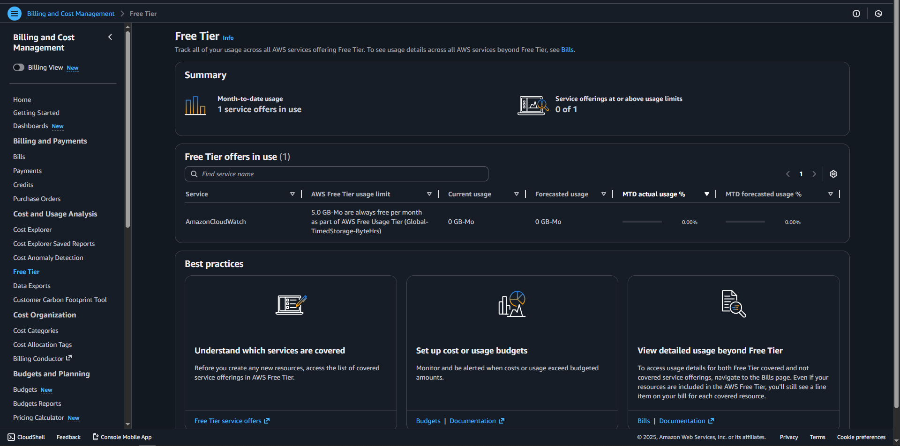

# Task 4: AWS Billing & Free Tier Cost Monitoring

## 📋 Project Overview

This project implements comprehensive cost monitoring and alerting for AWS accounts, with special focus on Free Tier usage tracking. The setup includes CloudWatch billing alarms, Free Tier usage alerts, and best practices for cost management to prevent unexpected charges while learning AWS.

---

## 🎯 Objectives

1. Enable billing alerts and Free Tier usage monitoring
2. Create CloudWatch billing alarms at multiple thresholds
3. Understand common AWS cost pitfalls for beginners
4. Implement cost optimization strategies
5. Establish daily/weekly monitoring routines
6. Document causes of unexpected cost increases

---

## 🚨 Why Cost Monitoring is Critical

### The Reality of AWS Billing for Beginners

**Common Scenario:**
> "I was just learning AWS and left a NAT Gateway running for 2 weeks. My bill was $25 when I expected $0."

### Top Reasons for Unexpected Charges

1. **Forgotten Resources** (Most Common)
   - NAT Gateway left running: ~$32/month
   - Stopped EC2 instances (EBS still charged): ~$0.80/instance/month
   - Unattached Elastic IPs: ~$3.65/month each
   - Running RDS databases: ~$15/month for t2.micro

2. **Exceeding Free Tier Limits**
   - Running 2+ t2.micro EC2s = 1,500+ hours/month (over 750 limit)
   - S3 storage > 5GB
   - Data transfer out > 100GB/month

3. **Expensive Service Deployment**
   - Load Balancers: ~$16/month each
   - NAT Gateway: ~$32/month + data processing
   - RDS Multi-AZ: Double the cost

4. **Security Breaches**
   - Exposed AWS credentials
   - Cryptocurrency mining on your account
   - Unauthorized resource creation
   - Can result in bills of $1,000+

---

## 📸 Screenshots Required

### Deliverables for Task 4

1. **Billing Preferences**


2. **Free Tier Usage Dashboard**


---

## 📝 Documentation Required

### 1. Brief Explanation - Why Cost Monitoring is Important

"Cost monitoring is essential for AWS beginners because it's easy to accidentally incur unexpected charges through forgotten resources or misunderstanding Free Tier limits. Common pitfalls include leaving NAT Gateways running ($32/month), exceeding the 750-hour EC2 limit by running multiple instances simultaneously, keeping unattached Elastic IPs ($3.65/month each), and accumulating unused EBS snapshots. Without proactive monitoring, these costs can add up quickly, potentially resulting in bills of $50-$200+ before discovery. 

Setting up CloudWatch billing alarms and Free Tier usage alerts provides early warning when costs approach set thresholds, allowing immediate investigation and corrective action before charges become significant. For example, an alert at 50% of budget ($0.60) gives time to identify issues like a forgotten running instance or accidental NAT Gateway deployment. Additionally, cost awareness develops good cloud engineering practices like regular resource cleanup, proper tagging, infrastructure automation, and resource lifecycle management that remain valuable throughout one's career, especially when managing production environments where cost optimization directly impacts business profitability."

### 2. Brief Explanation - What Causes Sudden Increases

"Sudden AWS bill increases typically stem from several common causes. Most frequently, accidental deployment of expensive resources like NAT Gateways ($32/month) or Application Load Balancers ($16/month), or launching multiple EC2 instances that collectively exceed the 750-hour Free Tier limit, quickly accumulate charges without immediate visibility. Forgotten resources pose significant risk: development environments left running over weekends, stopped EC2 instances with attached EBS volumes still generating storage charges, or unused security groups and snapshots from deleted resources.

Data transfer costs become substantial when exceeding the 100GB monthly Free Tier limit, particularly with large file downloads, cross-region transfers, or serving content directly from EC2 without CloudFront CDN. Storage accumulation through weekly EBS snapshots without cleanup policies, unused AMIs with associated snapshot costs, or S3 buckets growing unchecked can add up to significant monthly charges. Most critically, security breaches from exposed AWS credentials can lead to cryptocurrency mining operations or unauthorized resource creation, potentially causing bills in the thousands of dollars within days. Real incidents have shown attackers launching dozens of expensive GPU instances for mining before detection. Regular monitoring through billing alarms, daily email checks for alerts, weekly Free Tier dashboard reviews, and immediate investigation of any unusual activity helps identify and resolve these issues before they result in significant unexpected charges."

---

## 🔒 Security Considerations

### Protect Your AWS Credentials

```markdown
 NEVER DO THIS:
- Commit AWS credentials to Git repositories
- Share access keys via email/Slack
- Hardcode credentials in application code
- Use root account for daily operations
- Leave access keys in plaintext files

ALWAYS DO THIS:
- Use IAM roles for EC2 instances
- Enable MFA on root account
- Rotate access keys every 90 days
- Use AWS Secrets Manager for credentials
- Set up CloudTrail for audit logging
- Use IAM policies with least privilege
- Scan GitHub for exposed credentials
```
